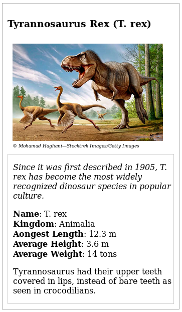

# Projects
I add simple projects, which are provided by Udacity Front-End-Developer Nanodegree.

<a href="#prject-1">Project 1: Mockup to Article</a>       
<a href="#prject-2">Project 2: Animal Trading Card</a>

<h2 id='project-1'>Project 1: Mockup to Article</h2>
This simple project is designed to practice HTML skills. The <a href="https://d17h27t6h515a5.cloudfront.net/topher/2016/December/58501f5b_mockup-to-article/mockup-to-article.zip">question</a> was a text with removed html tags and we were supposed that to use appropriate html tags to look like a give pdf mockup.            
The project solution link is <a href="./01_html_mockup_to_article/index.html">here</a>.

 <b>Skills: </b>HTML

 <h2 id='project-2'>Project 2: Animal Trading Card</h2>
 This simple project is designed to practice CSS skills. The <a href="https://github.com/udacity/animal-trading-cards/archive/master.zip">question</a> was to consider an animal we are interested and add css elements to style our animal page to the given png mockup.
 The project solution link is <a href="./02_css_animal_trading_card/index.html">here</a>.

  <b>Skills: </b>HTML, CSS

